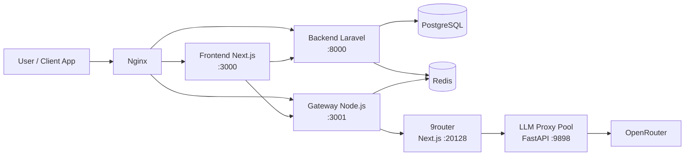
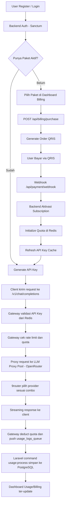

# LLMora.id

**Platform API Gateway AI untuk developer Indonesia** - akses model AI premium melalui satu endpoint OpenAI-compatible dengan billing lokal.


---

## Daftar Isi

- [Tentang](#tentang)
- [Arsitektur Sistem](#arsitektur-sistem)
- [Alur Kerja Lengkap](#alur-kerja-lengkap)
- [Prerequisites](#prerequisites)
- [Quick Start (Docker)](#quick-start-docker)
- [Manual Setup](#manual-setup)
- [Environment Variables](#environment-variables)
- [API Endpoints](#api-endpoints)
- [Struktur Project](#struktur-project)
- [Lisensi](#lisensi)

---

## Tentang

LLMora.id adalah platform API gateway yang memudahkan integrasi AI untuk developer di Indonesia.

Fitur utama:

- API kompatibel OpenAI (`/v1/chat/completions`)
- Pembayaran lokal via KlikQRIS
- API key management per user
- Quota dan rate limiting per plan
- Streaming real-time (SSE)
- Dashboard billing, usage, dan admin

---

## Arsitektur Sistem



| Service | Teknologi | Port | Fungsi |
| --- | --- | --- | --- |
| Frontend | Next.js 16 + React 19 | 3000 | Dashboard, docs, auth UI |
| Backend | Laravel 13 | 8000 | Auth, billing, API key, admin, usage |
| Gateway | Node.js + Express | 3001 | OpenAI-compatible proxy + streaming |
| 9router | Next.js | 20128 (lokal) | Router pool antar provider/upstream, A/B + failover |
| LLM Proxy | FastAPI + httpx | 9898 (internal) | Pool key OpenRouter + auto-rotasi + failover |
| Database | PostgreSQL 16 | 5432 | Data utama |
| Cache | Redis 7 | 6379 | Quota, rate limit, API key cache, queue |
| Reverse Proxy | Nginx | 80/443 | Routing domain + proxy |

---

## Alur Kerja Lengkap

### Ringkasan Alur End-to-End



### Detail Alur Operasional

1. User login melalui frontend (`/login`) menggunakan email/password atau Google OAuth.
2. Backend mengeluarkan token Sanctum untuk sesi API frontend.
3. Jika user belum memiliki paket aktif, user melakukan pembelian paket dari halaman billing.
4. Backend membuat transaksi QRIS dan menyimpan status `pending`.
5. Setelah pembayaran berhasil, webhook memicu aktivasi subscription dan reset quota.
6. User membuat API key untuk akses gateway AI.
7. Client eksternal memanggil endpoint gateway OpenAI-compatible.
8. Gateway membaca API key cache dari Redis, cek quota/rate limit, lalu meneruskan request ke **9router** (`http://127.0.0.1:20128/api/v1` saat lokal). 9router memilih provider yang sehat berdasarkan kombinasi/model yang sudah didaftarkan admin di dashboard 9router, lalu meneruskan ke `llm-proxy` (FastAPI). `llm-proxy` memilih API key OpenRouter dari pool (least-inflight), forward ke OpenRouter, dan otomatis failover/ganti key kalau ada error 401/402/429.
9. Gateway mengembalikan streaming/non-streaming response ke client.
10. Usage log diantrikan di Redis, lalu diproses Laravel scheduler ke PostgreSQL.
11. Dashboard menampilkan statistik penggunaan, transaksi, dan status paket terbaru.

### Scheduler dan Sinkronisasi Data

- `usage:process --batch=500` (setiap menit): memindahkan usage log dari Redis ke PostgreSQL.
- `quota:sync` (setiap 5 menit): sinkronisasi pemakaian quota Redis ke database.
- `apikey:cache-refresh` (setiap 1 jam): refresh API key cache aktif ke Redis.

---

## Prerequisites

- Docker v20+ dan Docker Compose v2+
- Untuk manual setup:
  - Node.js v20+
  - PHP 8.3+ dan Composer v2+
  - PostgreSQL 16+
  - Redis 7+

---

## Quick Start (Docker)

```bash
# 1) Clone repository
git clone https://github.com/radacore/llmore.git
cd llmore

# 2) Siapkan env file
cp .env.example .env
cp backend/.env.example backend/.env
cp gateway/.env.example gateway/.env

# 3) Generate Laravel APP_KEY
cd backend && php artisan key:generate && cd ..

# 4) Jalankan semua service
docker compose up -d

# 5) Jalankan migrasi + seeder
docker exec llmore-backend php artisan migrate --seed

# 6) Akses aplikasi
# Frontend: http://localhost
# Backend:  http://localhost/api
# Gateway:  http://localhost:3001
```

Perintah Docker yang sering dipakai:

```bash
# Lihat semua logs
docker compose logs -f

# Restart service tertentu
docker compose restart backend

# Rebuild image setelah ubah Dockerfile
docker compose up -d --build

# Stop semua service
docker compose down

# Stop + hapus volume (reset database)
docker compose down -v
```

---

## Manual Setup

### 1) Database

```bash
createdb llmore
```

### 2) Backend (Laravel)

```bash
cd backend
cp .env.example .env
composer install
php artisan key:generate
php artisan migrate --seed
php artisan serve --host=0.0.0.0 --port=8000
```

### 3) Frontend (Next.js)

```bash
cd frontend
npm install
npm run dev
```

### 4) Gateway (Node.js)

```bash
cd gateway
cp .env.example .env
npm install
node src/index.js
```

Atau jalankan semua service lokal sekaligus:

```bash
./start-all.sh
```

---

## Environment Variables

Salin `.env.example` root ke `.env`, lalu sesuaikan nilainya.

| Variable | Deskripsi | Default |
| --- | --- | --- |
| `DB_DATABASE` | Nama database PostgreSQL | `llmore` |
| `DB_USERNAME` | Username database | `llmore` |
| `DB_PASSWORD` | Password database | `secret` |
| `REDIS_HOST` | Host Redis | `127.0.0.1` |
| `REDIS_PORT` | Port Redis | `6379` |
| `GOOGLE_CLIENT_ID` | Google OAuth Client ID | - |
| `GOOGLE_CLIENT_SECRET` | Google OAuth Client Secret | - |
| `KLIKQRIS_API_KEY` | API key KlikQRIS | - |
| `KLIKQRIS_MERCHANT_ID` | Merchant ID KlikQRIS | - |
| `UPSTREAM_API_URL` | URL upstream OpenAI-compatible. Saat ini diarahkan ke **9router**. | `http://127.0.0.1:20128/api/v1` |
| `UPSTREAM_API_KEY` | Diisi kalau 9router meng-aktifkan `REQUIRE_API_KEY`; default kosong untuk lokal | - |
| `UPSTREAM_DEFAULT_MODEL` | Default model kalau client tidak menyebut model | `anthropic/claude-opus-4.7` |
| `NEXT_PUBLIC_API_URL` | URL backend untuk frontend | `http://localhost:8000/api` |
| `NEXT_PUBLIC_GATEWAY_URL` | URL gateway untuk frontend | `http://localhost:3001` |
| `GATEWAY_PORT` | Port service gateway | `3001` |

> Penting: jangan commit API key asli ke repository.

---

## API Endpoints

### Backend API (`/api`)

| Method | Endpoint | Deskripsi |
| --- | --- | --- |
| POST | `/api/auth/google` | Ambil URL redirect Google OAuth |
| GET | `/api/auth/google/callback` | Callback OAuth Google |
| POST | `/api/auth/login` | Login email/password |
| POST | `/api/auth/register` | Register user |
| POST | `/api/auth/logout` | Logout (auth required) |
| GET | `/api/user` | Profil user saat ini |
| GET | `/api/user/subscription` | Subscription aktif |
| GET | `/api/user/usage-summary` | Ringkasan usage |
| GET | `/api/api-keys` | List API key |
| POST | `/api/api-keys` | Buat API key |
| GET | `/api/api-keys/{id}` | Detail API key |
| DELETE | `/api/api-keys/{id}` | Revoke API key |
| GET | `/api/plans` | List plan aktif (public) |
| POST | `/api/billing/purchase` | Buat transaksi pembelian paket |
| GET | `/api/billing/transactions` | Riwayat transaksi user |
| GET | `/api/billing/payment-status/{orderId}` | Cek status pembayaran |
| POST | `/api/payment/webhook` | Webhook KlikQRIS (public) |
| GET | `/api/models` | List model AI |

### Gateway API (`/v1`)

| Method | Endpoint | Deskripsi |
| --- | --- | --- |
| POST | `/v1/chat/completions` | Chat completion OpenAI-compatible |
| GET | `/v1/models` | List model tersedia |
| GET | `/v1/usage` | Informasi quota usage API key |

Dokumentasi interaktif tersedia di frontend: `http://localhost:3000/docs`.

---

## Struktur Project

```text
llmore/
├── backend/            # Laravel 13 (auth, billing, admin, usage)
├── frontend/           # Next.js 16 (dashboard, docs, auth UI)
├── gateway/            # Node.js gateway OpenAI-compatible
├── docker/             # Dockerfile tiap service
├── nginx/              # Nginx reverse proxy config
├── plans/              # PRD dan dokumen perencanaan
├── docker-compose.yml
├── start-all.sh
└── README.md
```

---

## Lisensi

Project ini menggunakan [MIT License](LICENSE).
