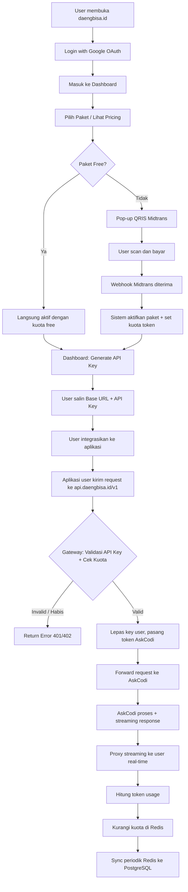
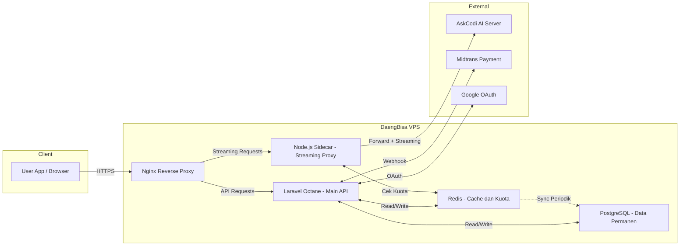
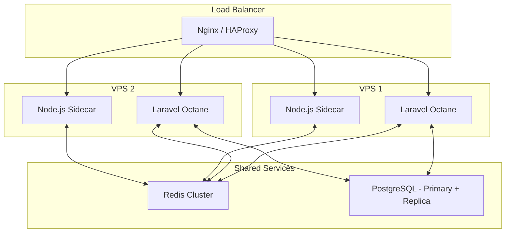

# PRD: DaengBisa.id — Platform API AI Gateway

> **Versi:** 1.0.0
> **Tanggal:** 1 Mei 2026
> **Status:** Draft
> **Author:** Tim DaengBisa

---

## Daftar Isi

1. [Ringkasan Eksekutif](#1-ringkasan-eksekutif)
2. [Latar Belakang & Masalah](#2-latar-belakang--masalah)
3. [Tujuan & Metrik Keberhasilan](#3-tujuan--metrik-keberhasilan)
4. [Target Pengguna](#4-target-pengguna)
5. [User Journey](#5-user-journey)
6. [Arsitektur Sistem](#6-arsitektur-sistem)
7. [Fitur & Requirements](#7-fitur--requirements)
8. [Model Paket & Pricing](#8-model-paket--pricing)
9. [API Specification](#9-api-specification)
10. [Infrastruktur & Skalabilitas](#10-infrastruktur--skalabilitas)
11. [Keamanan](#11-keamanan)
12. [Roadmap](#12-roadmap)
13. [Risiko & Mitigasi](#13-risiko--mitigasi)

---

## 1. Ringkasan Eksekutif

**DaengBisa.id** adalah platform API AI Gateway yang memungkinkan pengguna (developer, mahasiswa, startup) mengakses layanan AI melalui API yang terkelola. Platform ini bertindak sebagai **proxy/gateway** antara pelanggan dan provider AI backend (AskCodi), menangani autentikasi, manajemen kuota token, billing, dan streaming response secara real-time.

Platform ini **TIDAK** menjalankan model AI sendiri. Semua inferensi dilakukan oleh server AskCodi. VPS DaengBisa murni berfungsi sebagai **traffic proxy** — menerima request, memvalidasi, meneruskan ke AskCodi, dan mengembalikan response ke pelanggan.

---

## 2. Latar Belakang & Masalah

### Masalah yang Diselesaikan

| Masalah | Penjelasan |
|---------|------------|
| **Akses AI mahal** | Banyak developer/mahasiswa Indonesia kesulitan mengakses API AI premium karena kendala pembayaran internasional dan harga yang tinggi |
| **Kompleksitas integrasi** | Setiap provider AI memiliki format API berbeda; pelanggan butuh satu endpoint konsisten |
| **Tidak ada billing lokal** | Tidak ada platform lokal yang menyediakan API AI dengan pembayaran QRIS/transfer bank lokal |
| **Manajemen kuota** | Developer kesulitan mengontrol pengeluaran API AI tanpa sistem kuota yang jelas |

### Peluang

- Pasar developer Indonesia yang terus bertumbuh
- Kebutuhan AI integration di kalangan mahasiswa untuk skripsi/proyek
- Belum ada kompetitor lokal yang menawarkan API AI gateway dengan pembayaran lokal

---

## 3. Tujuan & Metrik Keberhasilan

### Tujuan Utama

1. Menyediakan akses API AI yang mudah dan terjangkau bagi developer Indonesia
2. Membangun platform gateway yang scalable dan reliable
3. Monetisasi melalui margin token resale

### Key Metrics (KPI)

| Metrik | Target Tahun 1 |
|--------|----------------|
| Total Registered Users | 1.000 |
| Monthly Active Users (MAU) | 300 |
| Monthly Recurring Revenue (MRR) | Rp 15.000.000 |
| API Uptime | >= 99.5% |
| Avg Response Latency (proxy overhead) | < 200ms |
| Churn Rate | < 10% per bulan |

---

## 4. Target Pengguna

### Persona Utama

#### 1. Mahasiswa (Budi)
- **Kebutuhan:** API AI untuk proyek skripsi/tugas akhir
- **Budget:** Terbatas (Rp 25.000 - Rp 50.000/bulan)
- **Prioritas:** Harga murah, dokumentasi jelas, mudah diintegrasikan

#### 2. Freelance Developer (Rina)
- **Kebutuhan:** API AI untuk fitur chatbot/AI di proyek klien
- **Budget:** Menengah (Rp 100.000 - Rp 300.000/bulan)
- **Prioritas:** Reliability, kecepatan response, API yang konsisten

#### 3. Startup/Tim Kecil (PT Inovasi)
- **Kebutuhan:** API AI untuk produk SaaS mereka
- **Budget:** Tinggi (Rp 500.000 - Rp 2.000.000/bulan)
- **Prioritas:** SLA, volume tinggi, dukungan dedicated, rate limit tinggi

#### 4. Enterprise (Perusahaan Besar)
- **Kebutuhan:** API AI untuk integrasi ke sistem internal perusahaan
- **Budget:** Custom
- **Prioritas:** SLA ketat, keamanan, compliance, dedicated support

---

## 5. User Journey

### Alur Lengkap (End-to-End)



### Fase Detail

#### Fase 1: Onboarding & Transaksi
1. User membuka **daengbisa.id** dan melakukan **Login with Google** (OAuth 2.0)
2. User masuk ke dashboard, melihat daftar paket, lalu klik **Beli**
3. Muncul pop-up **QRIS via Midtrans**. User scan dan bayar
4. Sistem Laravel menerima **webhook Midtrans**, mengaktifkan status user dan memberi kuota token sesuai paket

#### Fase 2: Mendapatkan & Memasang API Key
1. Di dashboard, user klik **Generate API Key**
2. Sistem membuatkan kunci unik dengan prefix, contoh: `daeng_sk_abc123xyz`
3. User menyalin **Base URL** (`https://api.daengbisa.id/v1`) dan **API Key** ke dalam kode aplikasinya

#### Fase 3: Penggunaan API (Di Balik Layar)
1. Aplikasi user mengirim prompt ke server DaengBisa
2. Gateway mengecek ke **Redis**: validitas API key dan sisa kuota
3. Jika kuota habis → return `402 Payment Required`
4. Jika aman → lepas key user, pasang **Token AskCodi**, forward ke server AskCodi
5. AskCodi memproses dan membalas via **streaming**
6. Server proxy streaming response ke user secara **real-time**
7. Setelah selesai, hitung panjang token response dan kurangi kuota user di Redis
8. Secara periodik (tiap 5 menit), sinkronkan data kuota dari Redis ke PostgreSQL

---

## 6. Arsitektur Sistem

### Tech Stack

| Komponen | Teknologi |
|----------|-----------|
| **Backend API** | Laravel Octane (Swoole/RoadRunner) |
| **Streaming Proxy / Sidecar** | Node.js (untuk handle SSE/streaming) |
| **Frontend Dashboard** | React / Next.js (SPA) |
| **Database** | PostgreSQL |
| **Cache / Session / Kuota** | Redis |
| **Payment Gateway** | Midtrans (QRIS, VA, e-wallet) |
| **Auth** | Google OAuth 2.0 + Laravel Sanctum |
| **AI Backend** | AskCodi API |
| **Web Server** | Nginx (reverse proxy) |
| **VPS** | Linux (Ubuntu) |
| **Monitoring** | Prometheus + Grafana / Laravel Telescope |

### Diagram Arsitektur



### Pembagian Tanggung Jawab

| Komponen | Tanggung Jawab |
|----------|----------------|
| **Laravel Octane** | Auth, user management, billing, webhook Midtrans, API key management, dashboard API, kuota sync |
| **Node.js Sidecar** | Menerima request AI, validasi via Redis, proxy streaming ke AskCodi, hitung token usage |
| **Redis** | Simpan kuota real-time, rate limiting, session cache, API key validation cache |
| **PostgreSQL** | Data user, transaksi, histori usage, paket, API keys, audit log |
| **Nginx** | SSL termination, routing request ke Laravel atau Node.js berdasarkan path |

---

## 7. Fitur & Requirements

### 7.1 Autentikasi & User Management

| ID | Fitur | Prioritas | Deskripsi |
|----|-------|-----------|-----------|
| AUTH-01 | Login with Google | P0 | OAuth 2.0 login via Google |
| AUTH-02 | User Profile | P0 | Halaman profil user dengan info akun |
| AUTH-03 | Session Management | P0 | JWT/token-based session via Laravel Sanctum |
| AUTH-04 | Login with GitHub | P2 | OAuth tambahan untuk developer |
| AUTH-05 | Email/Password Login | P1 | Alternatif login tanpa OAuth |

### 7.2 Dashboard

| ID | Fitur | Prioritas | Deskripsi |
|----|-------|-----------|-----------|
| DASH-01 | Overview | P0 | Ringkasan: sisa kuota, paket aktif, usage chart |
| DASH-02 | API Key Management | P0 | Generate, revoke, dan list API keys |
| DASH-03 | Usage Analytics | P0 | Grafik penggunaan token harian/mingguan/bulanan |
| DASH-04 | Billing History | P0 | Riwayat transaksi dan invoice |
| DASH-05 | Playground | P1 | Coba API langsung dari dashboard tanpa koding |
| DASH-06 | Usage Alerts | P1 | Notifikasi saat kuota mendekati limit - email/in-app |
| DASH-07 | Team Management | P2 | Invite anggota tim, shared quota - untuk Enterprise |

### 7.3 Billing & Payment

| ID | Fitur | Prioritas | Deskripsi |
|----|-------|-----------|-----------|
| BILL-01 | Integrasi Midtrans | P0 | QRIS, Virtual Account, e-wallet |
| BILL-02 | Webhook Handler | P0 | Terima dan proses notifikasi pembayaran dari Midtrans |
| BILL-03 | Auto-activate Paket | P0 | Otomatis aktifkan paket setelah pembayaran berhasil |
| BILL-04 | Invoice Generation | P1 | Generate invoice PDF untuk setiap transaksi |
| BILL-05 | Auto-renewal | P2 | Perpanjangan otomatis paket bulanan |
| BILL-06 | Top-up Token | P1 | Beli tambahan token tanpa upgrade paket |
| BILL-07 | Refund System | P2 | Proses refund untuk kasus tertentu |

### 7.4 API Gateway

| ID | Fitur | Prioritas | Deskripsi |
|----|-------|-----------|-----------|
| GW-01 | API Key Validation | P0 | Validasi API key dari header request |
| GW-02 | Quota Check | P0 | Cek sisa kuota token via Redis sebelum forward |
| GW-03 | Request Proxy | P0 | Forward request ke AskCodi dengan token internal |
| GW-04 | Streaming Response | P0 | Proxy SSE/streaming dari AskCodi ke client |
| GW-05 | Token Counting | P0 | Hitung jumlah token input + output |
| GW-06 | Quota Deduction | P0 | Kurangi kuota di Redis setelah request selesai |
| GW-07 | Rate Limiting | P0 | Batasi jumlah request per menit sesuai paket |
| GW-08 | Error Handling | P0 | Return error code yang jelas: 401, 402, 429, 500, 503 |
| GW-09 | Request Logging | P1 | Log setiap request untuk analytics dan debugging |
| GW-10 | Multi-model Support | P2 | Support multiple AI provider, bukan hanya AskCodi |
| GW-11 | Caching Response | P2 | Cache response untuk prompt identik - opsional |

### 7.5 Admin Panel

| ID | Fitur | Prioritas | Deskripsi |
|----|-------|-----------|-----------|
| ADM-01 | User Management | P0 | List, search, suspend, activate user |
| ADM-02 | Transaction Monitor | P0 | Monitor semua transaksi pembayaran |
| ADM-03 | Usage Dashboard | P0 | Overview total usage, revenue, active users |
| ADM-04 | Paket Management | P1 | CRUD paket/pricing dari admin panel |
| ADM-05 | System Health | P1 | Monitor status server, Redis, database, AskCodi connectivity |
| ADM-06 | Manual Quota Adjust | P1 | Tambah/kurangi kuota user secara manual |
| ADM-07 | Announcement System | P2 | Kirim pengumuman ke semua user |

### 7.6 Dokumentasi API

| ID | Fitur | Prioritas | Deskripsi |
|----|-------|-----------|-----------|
| DOC-01 | API Reference | P0 | Dokumentasi lengkap endpoint, parameter, response |
| DOC-02 | Quick Start Guide | P0 | Panduan mulai cepat dengan contoh kode |
| DOC-03 | Code Examples | P0 | Contoh integrasi dalam Python, JavaScript, PHP, cURL |
| DOC-04 | Interactive Docs | P1 | Swagger/OpenAPI atau Postman collection |
| DOC-05 | SDK Library | P2 | Official SDK untuk Python dan JavaScript |

---

## 8. Model Paket & Pricing

### Tabel Paket

| Fitur | Free | Mahasiswa | Pro | Enterprise |
|-------|------|-----------|-----|------------|
| **Harga/bulan** | Rp 0 | Rp 25.000 | Rp 150.000 | Custom |
| **Token Kuota** | 10.000 | 100.000 | 1.000.000 | Unlimited / Custom |
| **Rate Limit** | 5 req/menit | 20 req/menit | 100 req/menit | Custom |
| **API Keys** | 1 | 2 | 10 | Unlimited |
| **Streaming** | Ya | Ya | Ya | Ya |
| **Model Akses** | Standar | Standar | Semua Model | Semua Model + Priority |
| **Support** | Community | Email | Email + Priority | Dedicated |
| **Analytics** | Basic | Basic | Advanced | Advanced + Custom |
| **Team Members** | - | - | - | Ya |
| **SLA** | - | - | 99% | 99.9% |
| **Top-up Token** | Tidak | Ya | Ya | Ya |

### Mekanisme Kuota

- Kuota dihitung berdasarkan **total token (input + output)** per request
- Kuota direset setiap **awal periode billing** (tanggal pembelian)
- Sisa kuota yang tidak terpakai **tidak** di-rollover ke bulan berikutnya
- User akan menerima **notifikasi** saat kuota mencapai 80% dan 95%
- Saat kuota habis, API mengembalikan `402 Payment Required`
- User dapat melakukan **top-up** token tambahan (kecuali paket Free)

---

## 9. API Specification

### Base URL

```
https://api.daengbisa.id/v1
```

### Authentication

Semua request harus menyertakan API Key di header:

```
Authorization: Bearer daeng_sk_xxxxxxxxxx
```

### Endpoints

#### POST /v1/chat/completions

Request AI completion (kompatibel dengan format OpenAI).

**Request Body:**

```json
{
  "model": "askcodi-default",
  "messages": [
    {
      "role": "system",
      "content": "Kamu adalah asisten yang membantu."
    },
    {
      "role": "user",
      "content": "Jelaskan apa itu machine learning"
    }
  ],
  "stream": true,
  "max_tokens": 1024,
  "temperature": 0.7
}
```

**Response (non-streaming):**

```json
{
  "id": "daeng-xxxxxxxx",
  "object": "chat.completion",
  "created": 1714567890,
  "model": "askcodi-default",
  "choices": [
    {
      "index": 0,
      "message": {
        "role": "assistant",
        "content": "Machine learning adalah..."
      },
      "finish_reason": "stop"
    }
  ],
  "usage": {
    "prompt_tokens": 25,
    "completion_tokens": 150,
    "total_tokens": 175
  }
}
```

**Response (streaming - SSE):**

```
data: {"id":"daeng-xxx","choices":[{"delta":{"content":"Machine"},"index":0}]}

data: {"id":"daeng-xxx","choices":[{"delta":{"content":" learning"},"index":0}]}

data: {"id":"daeng-xxx","choices":[{"delta":{"content":" adalah"},"index":0}]}

data: [DONE]
```

#### GET /v1/usage

Cek sisa kuota dan usage.

**Response:**

```json
{
  "plan": "mahasiswa",
  "quota_total": 100000,
  "quota_used": 35420,
  "quota_remaining": 64580,
  "rate_limit": "20/min",
  "billing_cycle_end": "2026-06-01T00:00:00Z"
}
```

#### GET /v1/models

List model yang tersedia.

**Response:**

```json
{
  "data": [
    {
      "id": "askcodi-default",
      "name": "AskCodi Default",
      "description": "Model AI general purpose"
    }
  ]
}
```

### Error Codes

| HTTP Code | Kode Error | Deskripsi |
|-----------|-----------|-----------|
| 401 | `invalid_api_key` | API Key tidak valid atau sudah di-revoke |
| 402 | `quota_exceeded` | Kuota token habis |
| 429 | `rate_limit_exceeded` | Melebihi batas request per menit |
| 400 | `invalid_request` | Request body tidak valid |
| 500 | `internal_error` | Error internal server |
| 503 | `upstream_unavailable` | Server AskCodi tidak tersedia |

---

## 10. Infrastruktur & Skalabilitas

### Konfigurasi VPS Awal (Fase Launch)

| Komponen | Spesifikasi |
|----------|-------------|
| **CPU** | 2 Core |
| **RAM** | 2 GB |
| **Storage** | 40 GB SSD |
| **Bandwidth** | Unlimited / min 1 Gbps port |
| **OS** | Ubuntu 22.04 LTS |

### Strategi Skalabilitas

DaengBisa adalah **proxy/gateway**, bukan AI inference server. Beban utama ada di:

#### A. Bandwidth (Prioritas Tertinggi)

Karena server menerima teks dari AskCodi dan meneruskannya ke client, traffic jaringan akan tinggi.

- **Kebutuhan:** Network port minimal 1 Gbps, kuota bandwidth besar atau unlimited
- **Monitoring:** Track bandwidth usage harian

#### B. RAM & CPU (Koneksi Simultan)

Setiap request AI membuka koneksi yang menggantung selama beberapa detik (streaming). Ini membutuhkan penanganan concurrent connections.

- **Laravel Octane + Node.js** mampu menahan ribuan koneksi dengan 2 GB RAM
- **Trigger upgrade:** CPU konsisten di atas 80%, concurrent users > 200 simultan

| Fase | Users Aktif Simultan | Spesifikasi VPS |
|------|---------------------|-----------------|
| Launch | 1-50 | 2 Core / 2 GB RAM |
| Growth | 50-200 | 2 Core / 4 GB RAM |
| Scale | 200-500 | 4 Core / 8 GB RAM |
| Scale+ | 500+ | Load Balancer + Multiple VPS |

#### C. Database (Pengecekan Kuota)

- **Redis** menangani semua pengecekan kuota real-time (sub-millisecond)
- **PostgreSQL** hanya untuk penyimpanan permanen
- **Sync:** Redis ke PostgreSQL setiap 5 menit via scheduled job
- **Trigger upgrade:** Jika Redis memory usage > 70%, tambah RAM atau pisahkan Redis ke server terpisah

### Diagram Skalabilitas Masa Depan



---

## 11. Keamanan

### Autentikasi & Otorisasi

| Aspek | Implementasi |
|-------|-------------|
| **User Auth** | Google OAuth 2.0 + Laravel Sanctum (JWT) |
| **API Auth** | API Key dengan prefix `daeng_sk_` |
| **Admin Auth** | Role-based access control (RBAC) |
| **API Key Storage** | Hash API key di database, tampilkan hanya sekali saat generate |

### Keamanan Infrastruktur

| Aspek | Implementasi |
|-------|-------------|
| **HTTPS** | SSL/TLS via Let's Encrypt (wajib) |
| **Firewall** | UFW - hanya buka port 80, 443, 22 |
| **Rate Limiting** | Per API key, implementasi di Redis |
| **Input Validation** | Validasi semua input di Laravel + Node.js |
| **SQL Injection** | Eloquent ORM + parameterized queries |
| **CORS** | Whitelist domain yang diizinkan |
| **API Key Rotation** | User bisa revoke dan generate key baru kapan saja |

### Data Protection

| Aspek | Implementasi |
|-------|-------------|
| **Prompt Logging** | TIDAK menyimpan isi prompt user (privacy-first) |
| **Metadata Logging** | Hanya log: timestamp, token count, model, status code |
| **Payment Data** | Ditangani sepenuhnya oleh Midtrans (PCI DSS compliant) |
| **Backup** | Daily automated backup PostgreSQL |

---

## 12. Roadmap

### Fase 1: Foundation (MVP)

- Setup infrastruktur VPS: Nginx, PostgreSQL, Redis
- Backend Laravel Octane: Auth, User Management, Billing
- Integrasi Midtrans (QRIS)
- Node.js Sidecar: Proxy + Streaming ke AskCodi
- API Key management (generate, revoke)
- Kuota management di Redis
- Frontend Dashboard (Next.js): Login, Overview, API Keys, Usage
- Dokumentasi API dasar
- Paket: Free + Mahasiswa

### Fase 2: Growth

- Paket Pro
- Top-up token
- Advanced analytics di dashboard
- Playground (coba API dari browser)
- Usage alerts (email + in-app)
- Admin panel lengkap
- Invoice PDF generation
- Interactive API docs (Swagger)
- Monitoring (Prometheus + Grafana)

### Fase 3: Scale

- Paket Enterprise + Team Management
- Multi-model support (selain AskCodi)
- Official SDK (Python, JavaScript)
- Auto-renewal billing
- Load balancer + horizontal scaling
- Login with GitHub
- Caching response untuk prompt identik
- Refund system

### Fase 4: Mature

- Custom model fine-tuning untuk Enterprise
- Marketplace model
- Webhook untuk notifikasi usage ke customer
- Regional expansion
- Partner API program

---

## 13. Risiko & Mitigasi

| Risiko | Dampak | Probabilitas | Mitigasi |
|--------|--------|-------------|----------|
| **AskCodi down/tidak tersedia** | Tinggi | Sedang | Implementasi fallback ke provider AI lain; circuit breaker pattern; response cache |
| **Serangan DDoS** | Tinggi | Sedang | Cloudflare, rate limiting ketat, firewall rules |
| **Kebocoran API Key AskCodi** | Tinggi | Rendah | Simpan di environment variable, rotasi berkala, akses terbatas |
| **Fraud Payment** | Sedang | Sedang | Validasi webhook Midtrans dengan signature key, monitoring transaksi anomali |
| **Kuota tidak akurat** | Sedang | Sedang | Redis sebagai source of truth real-time, reconciliation job berkala ke PostgreSQL |
| **VPS overload** | Sedang | Rendah | Monitoring + alerting, auto-scaling plan, horizontal scaling ready |
| **Perubahan harga AskCodi** | Sedang | Sedang | Margin buffer di pricing, kontrak/agreement dengan AskCodi |
| **Data loss** | Tinggi | Rendah | Daily backup, Redis persistence (AOF), PostgreSQL WAL |

---

## Lampiran

### A. Glossary

| Istilah | Definisi |
|---------|----------|
| **Token** | Unit terkecil teks yang diproses oleh model AI. Rata-rata 1 token = 4 karakter dalam Bahasa Inggris |
| **Streaming (SSE)** | Server-Sent Events; teknik pengiriman data secara incremental dari server ke client |
| **Gateway/Proxy** | Server perantara yang meneruskan request dari client ke backend service |
| **Rate Limiting** | Pembatasan jumlah request yang bisa dilakukan dalam periode waktu tertentu |
| **Webhook** | HTTP callback yang dikirim oleh service eksternal saat terjadi event tertentu |
| **Sidecar** | Service tambahan yang berjalan berdampingan dengan service utama |

### B. Referensi

- [AskCodi API Documentation](https://askcodi.com)
- [Midtrans API Documentation](https://docs.midtrans.com)
- [Laravel Octane Documentation](https://laravel.com/docs/octane)
- [OpenAI API Format Reference](https://platform.openai.com/docs/api-reference)
